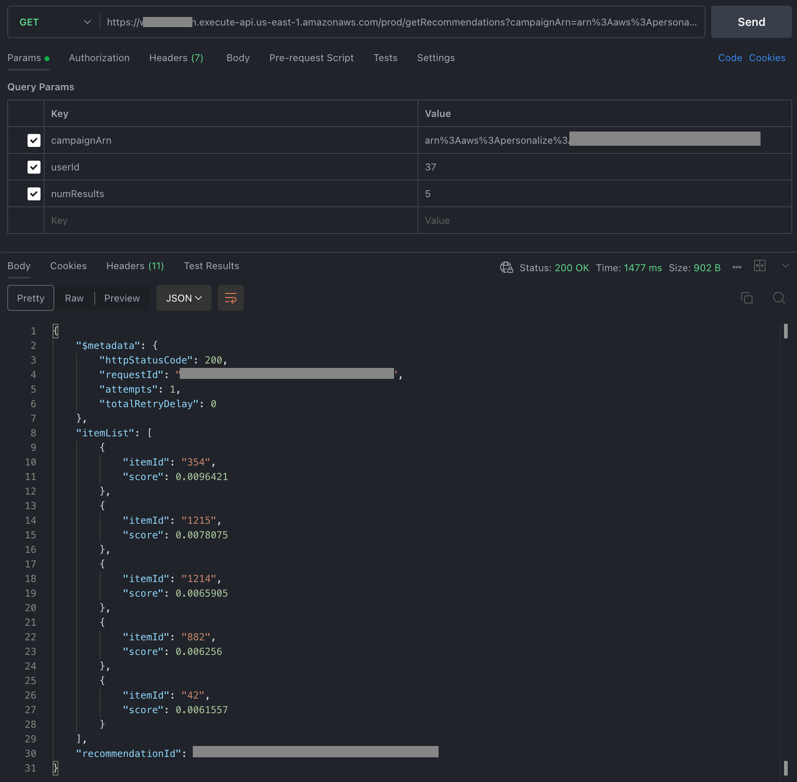
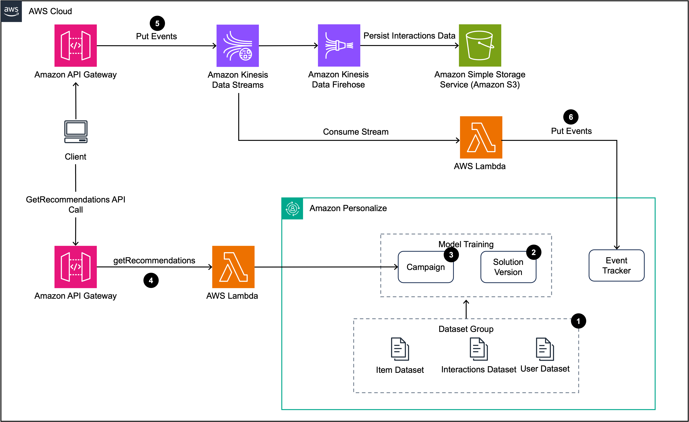
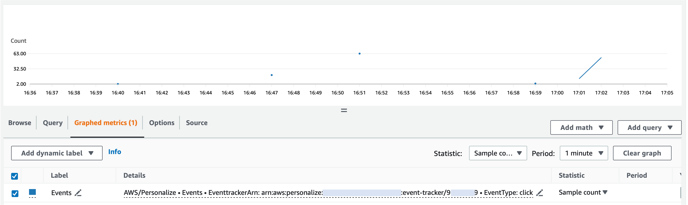

# Near real-time attraction recommendation system for Travel Free Pro

## Overview 
This repository contains the implementation of a real-time personalized travel attraction recommendation system, designed as a microservice for the Travel Free Pro mobile application. The architecture is based on [Amazon Personalize](https://aws.amazon.com/personalize/), inspired by the approach detailed in the blog post, ["Architecting near real-time personalized recommendations with Amazon Personalize"](https://aws.amazon.com/blogs/architecture/architecting-near-real-time-personalized-recommendations-with-amazon-personalize/).

The primary goal of this system is to provide a rapidly deployable solution that can be seamlessly integrated into existing applications. This integration aims to enhance applications with capabilities to offer personalized travel attraction recommendations.

The architecture leverages Amazon Personalize in conjunction with the Event Tracker feature to create a robust system capable of delivering real-time, personalized travel attraction recommendations. This solution is designed to enhance user engagement by delivering highly relevant content, thereby improving customer retention and satisfaction. These improvements provide a significant competitive edge, particularly useful for businesses involved in travel planning and related services.

## Key Features

- **Real-Time Recommendations**: Leverage real-time data processing to provide immediate personalized travel recommendations based on user interactions and preferences.

- **Seamless Integration**: Designed as a microservice, this system can be effortlessly integrated into existing travel planning applications, enhancing them with advanced recommendation capabilities without significant alterations to their architecture.

- **User Behavior Tracking**: Incorporates an Event Tracker that captures and analyzes user actions within the application, allowing for more tailored and accurate recommendations based on individual travel interests and behavior patterns.

- **Scalable Architecture**: Built on Amazon Personalize, the architecture is inherently scalable, capable of handling varying loads from different numbers of users, making it suitable for applications ranging from startups to large enterprises.

- **Feedback Loop**: Implements a continuous feedback mechanism that refines recommendation algorithms based on user interactions and satisfaction, ensuring the system evolves to meet user expectations better.

- **Diverse Recommendation Criteria**: Not only based on user history but also considers contextual factors like location, time of the year, and local events, providing diverse and dynamic travel suggestions.

- **Privacy-First Design**: Ensures user data is handled with the utmost security and compliance with privacy laws, making sure that personal information is protected while delivering personalized experiences.

- **Analytics Dashboard**: Features an integrated analytics dashboard on AWS that provides insights into user behavior, system performance, and recommendation effectiveness, helping to drive business decisions and system improvements.

## Result
After deployment, recommendations can be received in real-time through API calls.


## Real time recommendations with Event Tracker architecture

Prior to delving into the description of the architecture components, it is necessary to mention the stack of technologies on which the solution is based for resource provisioning.
The project is built with AWS Cloud Development Kit using Javascript ([AWS CDK](https://docs.aws.amazon.com/cdk/v2/guide/home.html)) and [SDK for JavaScript](https://aws.amazon.com/sdk-for-javascript/).
Amazon Personalize is a service that does not yet have official hand-written ([L2](https://docs.aws.amazon.com/cdk/v2/guide/constructs.html#constructs_lib)) constructors. So the automatically generated [L1](https://docs.aws.amazon.com/cdk/v2/guide/constructs.html#constructs_lib) constructors must be used. However, there are not all the constructors needed to implement the solution using only AWS CDK, so it is necessary to make use of SDK for JavaScript for the provisioning of missing resources. Figure 3 shows the real-time recommendation proposed architecture. 

### 1 Prerequisites

First of all, Amazon Personalize requires you to have a bucket ready to store the data you will use 
in the solution. The bucket must have the following bucket policy attached to it:

```javascript
{
    "Version": "2012-10-17",
        "Id": "PersonalizeS3BucketAccessPolicy",
        "Statement": [
        {
            "Sid": "PersonalizeS3BucketAccessPolicy",
            "Effect": "Allow",
            "Principal": {
                "Service": "personalize.amazonaws.com"
            },
            "Action": [
                "s3:GetObject",
                "s3:ListBucket"
            ],
            "Resource": [
                "arn:aws:s3:::bucket-name",
                "arn:aws:s3:::bucket-name/*"
            ]
        }
    ]
}
```
This is because the deployment project needs your data to be ready in the bucket, 
therefore the bucket cannot be created from the project itself as it would be empty at the time of deployment.

On the other hand, you must provide the data, in this case the interactions dataset, in form of a *.csv* file, required for Amazon Personalize and upload it to the S3
Bucket before deploying the solution. 

Recommendations are determined by analyzing the connections involving two main entities: users and items. Although the model is capable of suggestions based on a user's past interactions, the quality of these suggestions can be enhanced when the model possesses data about the associations among users or items.

The fake datasets used in this example are in `data/`, including `event_data.csv` `user_data.csv`, and `item_data.csv` files. 
The fake interactions dataset used in this example contains:

* `event_data.csv` contains interactions (EVENT_TYPE column) of users (USER_ID column) with items (ITEM_ID column), and travel attractions for this particular use case, in a given time (TIMESTAMP column). 
* `item_data.csv` contains travel attraction information including ID (ITEM_ID), the type of the attraction (GENRE) and a brief description (DESCRIPTION) of it.
* `user_data.csv` contains user (USER_ID) personal information with their age (AGE).

## 2 Deploying the solution

### 2.0 Install and configure [AWS CLI](https://aws.amazon.com/cli/) and [AWS CDK](https://aws.amazon.com/cdk/)
Make sure you can use `cdk` command in your development environment.

### 2.1 Deployment

Clone the repository using the following command: 
- `git clone https://github.com/FerrisChi/aws-personalize-recommendation-cdk.git`

In the root directory of the cloned repository, run the following command:

- `npm install --force` 

Export the following environment variables:

- `export bucketARN=` Whose value is the bucket ARN from the prerequisites section. For example _`arn:_aws:s3:::your-bucket-name`_.
- `export bucketObjectsARN=` Whose value is the bucket ARN from the prerequisites section containing the objects. For example  _`arn:aws:s3:::your-bucket-name/*`_
- `export interactionDataLocation=` Whose value is the URI of your interaction dataset. For example  _`s3://your-bucket-name/file.csv`._
- `export itemDataLocation=` Whose value is the URI of your item dataset. For example  _`s3://your-bucket-name/file.csv`._
- `export solutionRegion=` Region where the solution is deployed.

In the root directory run the following command:
```javascript
cdk deploy --parameters bucketARN=$bucketARN \
   --parameters bucketObjectsARN=$bucketObjectsARN \
   --parameters interactionDataLocation=$interactionDataLocation \
   --parameters itemDataLocation=$itemDataLocation \
   --parameters solutionRegion=$solutionRegion
   ```
Once the solution is deployed, you will see the output of the API Gateway which will be used in the next steps. 


CDK lacks the capability to generate three resources:
Solution Version, Campaign, and Event Tracker. 
To construct these components, it's necessary to utilize the specialized 
API designed for this intention. For this reason,
some lambdas contain permissions on resources by specifying that it is a wildcard. 
Since these resources are created after the deployment of the solution from CDK,
it is not possible to specify their ARNs.

Furthermore, you can find the `recommend.postman_collection.json` or `commands.sh` collection attached to the `assets/` directory to make the API calls.

### 2.2 Solution Version

The creation of the solution version is done by calling the `/solutionVersion` API which is a POST request with `solutionArn` and `version` (version name) as body request. You can find the ARN of the solution in the Amazon Personalize console once you deploy the application for the first time. For the version name, you can supply a name like 'v1' for example. As a result, the solution version ARN is retrieved which will be used in the next step.

Example:

```javascript
curl --location 'https://{your-api-id}.execute-api.{region}.amazonaws.com/prod/solutionVersion' \
--header 'Content-Type: application/json' \
--data '{
    "solutionArn" : "arn:aws:personalize:{region}:{accountId}:solution/my-sol-from-cdk",
    "version": "{your-solution-version}"
}'
```
Before proceeding, you must wait until the solution version is in ACTIVE status.
You can know the status of the solution version by calling the `/describeSolutionVersion` API
which is a POST request with the `solutionVersionArn` obtained from the previous request.
```javascript
curl --location 'https://{your-api-id}.execute-api.{region}.amazonaws.com/prod/describeSolutionVersion' \
--header 'Content-Type: application/json' \
--data '{
    "solutionVersionArn": "arn:aws:personalize:{region}:{accountId}:solution/my-sol-from-cdk/{your-solution-version}"
}
```

### 2.3 Campaign

The campaign will serve to offer personalized recommendations to users based on the recipe used in the previously created solution
version. For more information about recipes ARN see this [link](https://docs.aws.amazon.com/personalize/latest/dg/working-with-predefined-recipes.html).

To create the campaign the  `/campaign` API is invoked by providing the solution version ARN from the previous step and the name of the campaign as body of the POST request.

Example:
```javascript
curl --location 'https://{your-api-id}.execute-api.{region}.amazonaws.com/prod/campaign' \
--header 'Content-Type: application/json' \
--data '{
"solutionVersionArn" : "arn:aws:personalize:{region}:{accountId}:solution/{your-solution-name}/{your-solution-version}",
"name": "my-campaign"
}'
```

Note that the parameter `solutionVersionArn` must contain the value from the previous step.


Before proceeding, you must wait until the campaign is in ACTIVE status.

You can know the status of the solution version by calling the `/describeCampaign` API which is a POST request with the `campaignArn` obtained from the previous request.

### 2.4 Event Tracker
In order to ingest new data in the recommendation system, an Event tracker must be created. To achieve this, the `/eventTracker` API is invoked though an API call that sends the `name` of the EventTracker to create and the `dataSetGroupArn` as body params. The response contains the `trackingId` which is needed when you ingest new events to the solution.

Example:
```javascript
curl --location 'https://{your-api-id}.execute-api.{region}.amazonaws.com/prod/eventTracker' \
--header 'Content-Type: application/json' \
--data '{
"name" : "{your-event-tracker-name}",
"datasetGroupArn": "arn:aws:personalize:{region}:{accountId}:dataset-group/{your-dataset-group}"
}'
```

### Proposed Architecture data flow 



<span style="color:grey">Figure 2: Real time recommendation proposed architecture.</span>

**1.** Once you deploy the application for the first time, a dataset group is created which will contain the data that will be used to train the Amazon Personalize solution.

**2.** A Solution and a solution version are created to train a model using the data provided in the dataset group. 
The solution is trained with a recipe, in this case User-Personalization recipe is used. To learn more about the available recipes, 
please consult the following [link](https://docs.aws.amazon.com/personalize/latest/dg/working-with-predefined-recipes.html).

**3.** Once the solution version is ready The next step is to create a campaign which will serve to offer personalized 
recommendations to users based on the recipe used in the previously created solution
version.

**4.** The getRecommendations API is used to retrieve recommendations once the application is fully deployed.

**5.** The PutEvents API is used to send new interactions of your users with your items in your application to 
the recommendations system to provide updated recommendations.
In this example architecture, an event collection pipeline was build using Amazon API Gateway, Amazon Kinesis Data Streams, and 
Lambda to receive and transmitting interactions to Amazon Personalize. Furthermore, Amazon Simple Storage is integrated
with Amazon Kinesis Data Firehouse to persist the interactions data.

**6.** The Event Tracker is used to ingest new data in the recommendation system.

## 3 Getting recommendations
In this scenario, the interaction dataset comprises attraction IDs. Consequently, the recommendations presented to the user will consist of attraction IDs that align most closely with their personal preferences, determined from their historical interactions.

Remember that you can adapt the solution to the specific needs of your application as long as the requirements of the data dataset are fulfilled.

Once the application is fully deployed, you can use the `getRecommendations` API  to retrieve personalized recommendations for a 
particular user by sending its associated _userID_ from the interactions' dataset. Another parameters that is sent is the number of results or recommendations that you need for the particular user as well as the campaign ARN. You can find the campaign ARN in the Amazon Personalize console menu. 

For example, the following request will retrieve 5 recommendations for the user whose userId is 429:

```javascript
curl --location 'https://{your-api-id}.execute-api.{your-region}.amazonaws.com/prod/getRecommendations?campaignArn=arn%3Aaws%3Apersonalize%3A{your-region}%3A{your-account-id}%3Acampaign%2F{your-campaign}&userId=429&numResults=20' \
```

Response: 
```javascript
{
"$metadata": {
"httpStatusCode": 200,
"requestId": "15cdf43a-4579-4aa1-b708-650f24053263",
"attempts": 1,
"totalRetryDelay": 0
},
"itemList": [
    {
    "itemId": "364",
    "score": 0.0114603
    },
    {
    "itemId": "367",
    "score": 0.0107865
    },
    {
    "itemId": "589",
    "score": 0.0088221
    },
    {
    "itemId": "593",
    "score": 0.0087765
    },
    {
    "itemId": "587",
    "score": 0.0081915
    }
],
"recommendationId": "RID-db-45f5-9989-fa62daec7846-CID-f2c90e"
}

```
The items returned by the API call are the attractions that Amazon Personalize recommends to the given user based on their interactions.

The score values provided in this context represent floating-point numbers ranging between zero and 1.0. These values correspond to the current campaign and the associated recipes for this particular use case. They are determined based on the collective scores assigned to all items present in your comprehensive dataset.

Consequently, as the number of items within your dataset increases, the absolute values of these scores diminish. It is noteworthy that the cumulative sum of these scores across your entire dataset equates to 1.0. Hence, it is imperative not to attribute excessive significance to the absolute score values in the context of user-personalization. Rather, these scores should be utilized comparatively within the realm of the same recommendations response. This approach enables a comprehension of the varying degrees of strength in relevance among different items.

## 4 Ingesting real time interactions

In the previous example, recommendations were obtained for the user whose ID is 429. 
However, in most applications the recommendations change based on the user's interactions with the items. These interactions are ingested into the recommendation system through the Amazon Personalize [Event Tracker](https://docs.aws.amazon.com/personalize/latest/dg/recording-events.html). The type of interaction, also called EventType, is given by the column of the same name in the interaction data dataset (EVENT_TYPE), in this example, the events can be of type "watch" or "click", but you can have your own types 
of events according to the needs of your application.

For the purposes of the example, the exposed API that generates the events  of the users with the items, receives the "interactions" parameter that corresponds to the number of events (in other words, interactions) of a particular user (UserId) with a single element (itemId) in a given date range (dateFrom and dateTo). The `trackingId` parameter can be found in the Amazon Personalize console and in the response of the creation of Event Tracker request.


This is an example of a putEvent request: Generate 2 interactions of click type, with the item whose id is 364 for the user whose id is 429, in a date rage between
January 1, 2022 and April 5, 2023. Note that based on the proposed architecture, 
the events are sent to Amazon Kinesis Data Streams through an API Gateway, 
tha is the reason you need to send the `stream-name` and `PartitionKey` parameters.
Furthermore, the `trackingId` from the `createEvent` response request must be used. 


```javascript
curl --location 'https://{your-api-id}.execute-api.{your-region}.amazonaws.com/prod/data' \
--header 'Content-Type: application/json' \
--data '{
"stream-name": "my-stream",
    "Data": {
    "userId" : "429",
        "interactions": 3,
        "itemId": "185",
        "trackingId" : "{your-tracking-id}",
        "eventType": "click",
        "dateFrom" : "2022-01-01",
        "dateTo" : "2023-04-05"
},
"PartitionKey": "{your-partition-key}"
}'
```

You will receive a confirmation response like this: 

```javascript
{
    "Message": "Event sent successfully",
    "data": {
        "EncryptionType": "KMS",
        "SequenceNumber": "49..........1901314",
        "ShardId": "shardId-xxxxxxx"
    }
}
```
On the other hand, you can then check the CloudWatch Logs of the `PutEvents` lambda which show the result of every event sent to the `EventTracker`  as well as the details of the event by itself. In this case three interactions were sent, and the event response is logged as shown below. 

```javascript
[
    {
        "itemId": "364",
        "eventType": "click",
        "userId": "429",
        "response": {
            "$metadata": {
                "httpStatusCode": 200,
                "requestId": "5bf9c4f7-5b4d-44f6-8c3c-2a3c30898c82",
                "attempts": 1,
                "totalRetryDelay": 0
            }
        }
    },
    {
        "itemId": "364",
        "eventType": "click",
        "userId": "429",
        "response": {
            "$metadata": {
                "httpStatusCode": 200,
                "requestId": "d5aefde1-c8ed-403e-a2a7-c50979dfdf33",
                "attempts": 1,
                "totalRetryDelay": 0
            }
        }
    }
]
```


By now, your interactions dataset includes the API-generated events. Confirm their successful delivery to Amazon Personalize by reviewing Event Tracker metrics in CloudWatch under: All > AWS/Personalize > EventType, EventTrackerArn. Choose your EventTracker's ARN and the EventType from your API request. The Figure 4 shows an example of how the events are illustrated in CloudWatch metrics. Every blue cursor represent the number of events sent to the EventTracker in a given time. For demonstration purposes more than 2 events were sent.


<span style="color:grey">Figure 3: Events in CloudWatch Metrics.</span>

Since the interactions dataset has been updated, the recommendations will also be automatically updated to take into account the new interactions. To do this, we can call the `getRecommendations` API again for the same user, whose id is 429, and the result should be different from the previous one. 

Request: 

```javascript
curl --location 'https://{your-api-id}.execute-api.{your-region}.amazonaws.com/prod/getRecommendations?campaignArn=arn%3Aaws%3Apersonalize%3A{your-region}%3A{your-account-id}%3Acampaign%2F{your-solution}&userId=429&numResults=20' \
```

Response: 

```javascript
{
    "$metadata": {
        "httpStatusCode": 200,
        "requestId": "860e6791-9eb1-47d0-a527-bbfde4d36b21",
        "attempts": 1,
        "totalRetryDelay": 0
    },
    "itemList": [
        {
            "itemId": "367",
            "score": 0.0280991
        },
        {
            "itemId": "224",
            "score": 0.0232656
        },
        {
            "itemId": "480",
            "score": 0.0210429
        },
        {
            "itemId": "377",
            "score": 0.0190929
        },
        {
            "itemId": "60",
            "score": 0.0168541
        }
    ],
    "recommendationId": "RID-ef-45f1-85e8-fce9564dafee-CID-f2c90e"
}
```

Note that it was not necessary to create a new solution version after ingesting the new interactions. This is because for 
the case of the type of recipe used in this example _-User-Personalization recipe-_ Amazon Personalize automatically incorporates new items into your most recent fully trained solution version to enhance recommendations. For more information about how real-time events influence recommendations see [this](https://docs.aws.amazon.com/personalize/latest/dg/recording-events.html) link.

## 5 Cleaning up resources

To avoid incurring unnecessary charges, you can delete the resources once have finished your tests. 
Firstly, use the `deleteResources` delete API. You need to pass the Event Tracker ARN as well as the campaign ARN.


```javascript
curl --location --request DELETE 'https://{your-api-id}.execute-api.{your-region}.amazonaws.com/prod/deleteResources' \
--header 'Content-Type: application/json' \
--data '{
    "campaignArn" : "{your-campaign-arn}",
    "eventTrackerArn": "{your-eventTracker-arn}"
}'
```

Deleting the campaign usually takes several minutes to be completed. Before proceeding, make sure that is completely deleted by calling the `describeCampaign` API.
You will see a message indicating that the campaign is deleted or does not exist. 

Then, you can run the following command in the root directory of the repository to delete completely the resources created.

- `cdk destroy`

## Conclusion

In this project, we demonstrated the implementation and deployment of a real-time personalized travel attraction recommendation system using Amazon Personalize, coupled with various AWS data services. This system is designed to offer APIs for both retrieving personalized recommendations and ingesting new user events, ensuring seamless integration with existing applications, irrespective of the programming language or platform used. Additionally, the adoption of Infrastructure as Code (IaC) tools significantly accelerates deployment, allowing for rapid scalability and easy maintenance. This approach not only enhances user engagement through personalized experiences but also provides a flexible, efficient solution for businesses looking to improve their service offerings in the travel industry.
